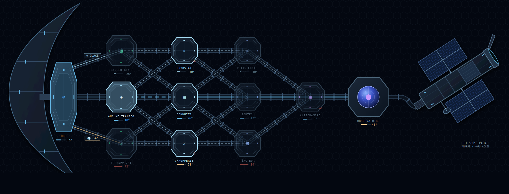
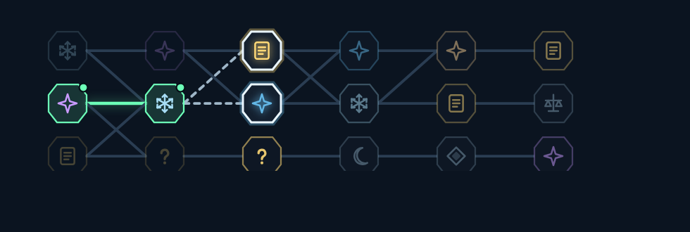

# Les routes de Sujet 21 — le système, ses paramètres, ses pistes

> Le document de synthèse demandé le 16/09/2026 : ce que la route d'une run
> met en jeu (transformations, chaleur, biome, difficulté, récompenses,
> salles bonus, natures de salle), comment ces éléments se tiennent, où le
> concepteur règle chaque paramètre, et ce qui reste à inventer pour que le
> jeu cesse de citer Slay the Spire et parle sa propre langue. La carte
> elle-même est décrite dans `carte-station.md` ; ici, la mécanique.

---

## 1. Les deux échelles d'une route

Une run se choisit à deux échelles, et chaque échelle a son écran.

### 1.1 La station — la grande carte

La station est découpée en **modules**. Chaque module est un **biome** : un
ensemble de six salles, une nature dominante (combat, énigme), une
température, parfois un cran de confinement. Plusieurs modules peuvent
porter le même biome. La grande carte ne montre **que** des biomes — ni
haltes, ni « ? », ni types de tableau : ceux-là vivent dans le module.

On y choisit **le module suivant**, à la sortie de chaque module. Le survol
d'un module — à la souris, au clavier ou à la manette, viser vaut
survoler — dit ce qu'on y trouvera, par types et sans compter — « on y
trouve : eau, glace, figures, rencontre, économat, alcôve » —, ce que la
porte ouvre juste après, et ce qu'elle ferme (les modules qu'on ne pourra
plus joindre s'éteignent).

### 1.2 Le module — la mini-carte

Dans un module, les six salles se **tissent** en six rangs sur trois voies,
depuis une graine (celle du jour, commune à tous les postes, ou celle de
la run). Entre deux salles, la mini-carte montre ce qui vient : chaque
tuile porte l'icône de sa nature — une salle (eau, glace, vapeur, toutes
mécaniques ; figure ; tableau du pool), une **rencontre** (le « ? », on ne
sait pas laquelle), ou une **halte** (l'économat, l'alcôve, la bonbonne
oubliée, la cache à orbe). Les portes proposées sont les tuiles joignables
depuis celle qu'on vient d'ouvrir : **ouvrir une porte ferme les autres**.
Le chemin déjà joué se coche rang par rang ; les rangs passés sans porte
(une sauvegarde d'une autre version) restent gris, et le rang suivant
ouvre ses trois tuiles.

**D'où viennent les salles.** Générées actives (l'ordinaire), une voie par
rang porte un tableau du pool, les deux autres se fabriquent à l'ouverture
de la porte. Générées coupées, **la mini-carte est la même** : chaque
porte salle pioche un tableau déjà écrit **de la mécanique de son nœud**,
dans le biome du module, jamais deux fois le même dans un choix. S'il n'y
en a aucun, l'option « générer si le pool manque » fabrique la salle et
la porte le dit (« GÉNÉRÉE — LE POOL MANQUE (glace) ») ; le manque se
note pour le concepteur (§4.2).

Les deux s'emboîtent : la carte décide du **biome** (la température, le
cran, la nature dominante, la cache), la mini-carte décide du **rythme**
(salle, rencontre, halte) et ferme les voies qu'on n'a pas prises. La
longueur d'une run n'est pas un réglage : elle découle du trajet — trente
salles sur la carte livrée, vingt-sept par la voie courte des soutes.

---

## 2. Ce qui fait la matière d'un choix

Un choix ne vaut que si les options se distinguent **avant** qu'on les
prenne. Voici les six leviers qui distinguent deux routes, et ce que le
joueur en lit.

### 2.1 Les transformations acquises — les cadenas

Une coursive peut exiger un **orbe d'essence de conscience** (glace :
solidification, vapeur : vaporisation). Un cadenas lit un ACQUIS durable,
pas l'état du corps à l'instant : la carte se lit comme une progression.
Le contrat du §9.3 du document fonctionnel tient : un déblocage ouvre un
chemin **latéral**, jamais un raccourci — les routes de la carte livrée
font trente salles, sauf celles qui passent par les soutes (vingt-sept),
et cette voie courte n'est pas un raccourci : elle se paie en récompenses
et en rampe (§2.7). La vérification tolère trois salles d'écart, pas plus.

*Ce que le joueur lit* : le cadenas sur le plan, l'orbe qui manque dans la
fiche, la secousse quand il insiste.

### 2.2 La chaleur — le climat d'une route

Chaque module porte une température. Elle fait le **climat** des dangers
des salles générées : sous 10 °C des hublots fendus (le froid, sur la
coque), dès 45 °C des chaudières, entre les deux le pile ou face. Une route
froide se joue en glace, une route chaude en vapeur : **la route est le
build**. Deux joueurs aux mémoires différentes ne prennent pas la même.

*Ce que le joueur lit* : la barre de température sous chaque module, la
couleur du nom.

### 2.3 Le biome — ce que la pioche ose

Un module porte un biome, et plusieurs modules partagent le même : la
carte livrée en a cinq — **cryo** (T1, C1, P1), **tempéré** (T2, C2, P2),
**chaud** (T3, C3, P3), **antichambre**, **observatoire**. La `nature` du
module pose la posture des salles (combat : dangers fréquents, pas
d'énigme ; énigme : aucun danger, un faisceau à lire), son `biome` filtre
les tableaux du pool, et **pèse au tissage** : une part réglable des voies
de la mini-carte prend la mécanique favorite du biome — la glace en cryo,
la vapeur en chaud, toutes en antichambre —, jamais les trois voies d'un
rang. Choisir la voie froide sur la grande carte, c'est savoir que sa
glace y servira.

*Ce que le joueur lit* : le glyphe du module, la nature dans la fiche, les
icônes de la mini-carte.

### 2.4 La difficulté — la rampe et le cran

La rampe du plan monte de 0 au plafond sur la longueur de la run, en dents
de scie (respiration), avec une finale à prendre. Le **cran** d'un module
s'y ajoute : « plus difficile, plus généreux » — la mémoire du sas se
multiplie par 1 + cran. Une rencontre peut aussi **réveiller la station** :
un cran promis à la prochaine salle, qui s'éteint quand il est servi.

*Ce que le joueur lit* : le « +1 » au coin du fût, « CONFINEMENT +1 ·
MÉMOIRE ×2 » en tête du choix de salle, « LA STATION EST RÉVEILLÉE ».

### 2.5 Les récompenses — ce qui dépend des premiers choix

C'est ici que la stratégie se noue. Les récompenses de Sujet 21 sont de
quatre monnaies, et les premiers choix les orientent :

| Monnaie | Durée | Où elle vient | Où elle va |
| --- | --- | --- | --- |
| **Condensat** | la run | chaque sas, les rencontres, le don | l'économat, les cartes payantes du tirage |
| **Mémoire** | durable | chaque sas (×2 sous cran), les rencontres | le marchand du hub : orbes, améliorations |
| **Instruments** | la run | les paliers d'étalonnage, les rencontres | des leviers sur le corps et les états |
| **Essence maximale** | la run | 100 % au départ, **rognée** par les sacrifices | ce que le corps a en naissant dans chaque salle |

Ce qui fait dépendre la fin du début :

- **Prendre la route sous cran tôt** donne de la mémoire tôt, donc des
  orbes plus vite au prochain passage au hub — c'est un pari sur la run
  suivante autant que sur celle-ci.
- **Sacrifier de l'essence** au décanteur achète un instrument fort, mais
  chaque salle jusqu'à la fin se joue avec un corps plus petit : le prix se
  paie trente fois.
- **Passer par l'économat** en acte 1 vaut si l'on a du condensat, donc si
  l'on a livré ; passer par l'alcôve vaut si l'on a perdu un échantillon.
- **Les orbes des caches** sont durables et une fois par poste : la route
  qui les vise ne sert qu'une fois — après, elle ne vaut que par ses salles.

### 2.6 Les salles bonus — les haltes

Les haltes sont des **nœuds de la mini-carte**, posés au tissage du
module : tant d'économats, d'alcôves et de bonbonnes par module (le plan
de descente en décide), et une cache quand le module recèle un orbe (la
carte en décide). Elles prennent la place d'une salle, jamais au premier
rang, jamais la dernière salle d'un rang. Comme les rencontres, elles
s'évitent en changeant de voie — et c'est ce qui en fait un choix : viser
l'alcôve, c'est renoncer à la salle d'à côté.

---

### 2.7 Les trois tempos — la symétrie cassée

La première carte à cinq biomes posait la même question à chaque acte :
le bord, sous cran et avec sa cache, ou le milieu, sûr. Et toutes les
routes se rejoignaient sur une antichambre sous cran. Depuis le 16/09,
chaque voie a **son tempo** :

| Voie | Acte 2 | Acte 3 | Ce qu'elle promet |
| --- | --- | --- | --- |
| **Froide** (cryo) | CRYOSTAT, cran 1, cache (sublimation) | PUITS FROID, calme | **payer tôt** : la mémoire double et l'orbe dès le milieu, puis on souffle |
| **Tempérée** | CONDUITS, énigme, rien | SOUTES, **trois salles** | **payer en salles** : vingt-sept au lieu de trente — trois sas de moins, donc moins de mémoire et de condensat, et une rampe plus raide |
| **Chaude** | CHAUFFERIE, rien | RÉACTEUR, **cran 2**, cache (condensation) | **payer tard, et gros** : la mémoire triple sur six salles à 80 °C, l'orbe derrière |

L'antichambre respire (aucun cran), et **le terminal est sous
confinement pour tout le monde** : la fin est un sommet, pas une voie.
Jamais deux crans d'affilée. Les coursives permettent de changer de voie à
chaque acte, donc de composer : froid tôt puis soutes, tempéré puis
réacteur.

*Ce que le joueur lit* : le « +1 » et le « +2 » au coin des fûts, les
« 3 salles » des soutes dans la fiche, la longueur qui passe de 27 à 30
quand il quitte la voie courte.

### 2.8 Les primes de nœud — les voies diffèrent par le gain

Dans Slay the Spire, l'élite promet une relique, et c'est ce qui fait
prendre le risque. Ici, chaque salle rendait la même chose au sas : deux
voies au même rang ne différaient que par ce qu'on y joue. Depuis le
16/09, un rang sur six environ (réglable) porte une **salle à prime**, un
losange au coin de sa tuile : plus dure d'un cran, elle paie **la mémoire
double**, **le condensat double** ou **un tirage d'instrument garanti**,
tiré au tissage. Une seule par rang, jamais au premier, jamais sur une
rencontre ni une halte : viser la prime, c'est renoncer à la salle d'à
côté, et c'est la deuxième dimension du choix de voie.

*Ce que le joueur lit* : le losange teinté sur la tuile (vert mémoire,
bleu condensat, or tirage), « PRIME : MÉMOIRE ×2 » sur la carte de la
porte et en tête de la mise en bonbonne.

## 3. Les natures de salle

Ce qui existe, ce qui est proposé.

### 3.1 Ce qui existe

| Nature | Où | Ce que c'est | Ce qui se règle |
| --- | --- | --- | --- |
| **Combat** | module (grande carte) | des salles à dangers fréquents, sans énigme au faisceau | la nature du module (éditeur de carte) |
| **Énigme** | module (grande carte) | aucun danger, une énigme au faisceau garde le passage | idem |
| **Terminal** | module (grande carte) | la Pompe (`boss-pompe.md`) | — |
| **Salle** | nœud de la mini-carte | un tableau à jouer : sa mécanique, figure ou compartiments, tableau du pool ou générée — générées coupées, un tableau écrit de la mécanique du nœud, généré s'il n'y en a pas | le plan (salles générées, générer si le pool manque, figures, tableaux écrits, pioche) |
| **Rencontre** | nœud de la mini-carte | du lore, deux ou trois offres, des issues pesées | la part, le rang minimal (LA DESCENTE), le catalogue `evenements.ts` |
| **Économat** | nœud de la mini-carte | le Semblable troque contre du condensat | économats par module (LA DESCENTE) |
| **Alcôve (repos)** | nœud de la mini-carte | un souffle, de la réserve ou du condensat — un seul des trois | alcôves par module ; `REPOS_RESERVE_L`, `REPOS_CONDENSAT_CL` |
| **Bonbonne oubliée (don)** | nœud de la mini-carte | de la réserve, ou du condensat si elle est pleine | bonbonnes par module |
| **Cache** | nœud de la mini-carte | un orbe d'essence, une fois par poste | `orbe` du module (éditeur de carte) |
| **Salle à prime** | un nœud salle, marqué d'un losange | la salle scellée : plus dure d'un cran, elle paie plus au sas — mémoire ×2, condensat ×2 ou tirage d'instrument garanti ; une par rang au plus, jamais au premier rang | salles à prime (LA DESCENTE) |
| **Mini-jeu : le couperet** | nœud de la mini-carte, posé comme une halte | un trait au sol, une lame qui tombe toutes les 4 s et reste baissée 1 s, un trait tiré entre 35 et 70 % du volume de départ : on met son corps à cheval sur le trait et on en laisse dépasser exactement ce qu'il demande — ce que la lame tranche au-delà, **d'un seul tenant avec le corps**, est pesé, on repart avec le reste ; les gouttes jetées ne pèsent rien. Pas de sas dans cette salle : la lame conclut. La consigne est écrite dans la salle, en trois pancartes numérotées. Au trait la mémoire triple, proche elle vaut, loin la moitié, ratée rien. S'essaie sans run : le pupitre « Jouer le couperet (essai) », ou `__couperet(1.5)` en console | mini-jeux par module (LA DESCENTE) ; `BAREME_TRAIT`, `RYTHME_COUPERET`, `COL_COUPERET` (`minijeux.ts`) |
| **Mini-jeu : le palet** | nœud de la mini-carte, tiré à la graine avec le couperet | une piste d'élan, une ligne de lancer, une maison de trois cercles : on prend de la vitesse, **la ligne gèle le corps quand il la franchit**, et la glace doit s'arrêter le plus près du centre. Trois lancers, le meilleur compte ; après chaque lancer, deux cartes : relancer (remise en place au départ, même volume de base) ou valider le meilleur ; un lancer finit quand la glace s'arrête, se dégèle ou traîne 12 s. Au centre la mémoire triple, dans la maison elle vaut, au bord la moitié, hors jeu rien. **Ses propres réglages** (`REGLAGES_PALET`) recouvrent le banc le temps de la salle : gel rapide, dégel rapide, éjection deux fois plus vive (l'élan se prend sans se vider : 14 % du corps pour 400 u/s au lieu de 29 %), glace qui rebondit, bumpers hydrophobes qui rendent plus qu'ils ne reçoivent, et une glisse freinée (`iceSlideDrag`, nulle partout ailleurs) pour qu'un lancer ait une longueur. S'essaie sans run : le pupitre « Jouer le palet (essai) », ou `__palet()` | `REGLES_PALET`, `REGLAGES_PALET` (`minijeux.ts`) |

Le modèle de carte garde les natures de module `economat`, `repos`, `don`,
`inconnu` et `coffre` : l'éditeur peut encore poser une halte ou un « ? »
sur la grande carte, et le jeu sait les jouer — mais la carte livrée n'en
a plus, par décision du concepteur (16/09).

### 3.2 Ce qui est proposé — les mini-jeux sur la physique du corps

Le concepteur veut des salles qui soient des **mini-jeux à partir du volume
du joueur**. Sujet 21 a un atout qu'aucun deck-builder n'a : le corps est
une simulation de fluide, et tout ce qu'on lui fait faire est déjà une
règle. Des propositions, chacune une salle sans sas ordinaire, chronométrée
ou comptée, où la physique EST le jeu.

**La leçon de la pesée (17/09).** Le premier mini-jeu demandait de *verser*
N litres dans une cuve. Joué, il s'est effondré : le sas boit tout ce qui
arrive, et le seul verbe du jeu est jeter — la meilleure façon de jouer
était de se caler dos au mur et d'arroser le sas depuis l'autre bout de la
salle. Le défaut était dans la règle, pas dans le réglage : tout mini-jeu
qui compte ce qui entre dans un trou finit pareil. Deux règles en sont
sorties, et tout mini-jeu à venir doit les tenir :

1. **On pèse le corps, pas les gouttes.** Le solveur sait ce qui « fait
   corps » (la composante connexe du joueur, celle des gouttes en prêt) ;
   une goutte lancée au loin ne compte pas.
2. **Entrer doit être un geste du corps** — se placer, s'étirer dans un
   col, geler — ce qu'une goutte tirée du fond de la salle ne sait pas
   faire.

**La leçon du flipper (17/09).** Essayé puis retiré le jour même : le corps
en bille de glace, tiré par un courant, deux flippers en portes éventail.
Joué : « aucun contrôle possible, je ne vois pas l'intérêt ». La règle
qu'il violait : **le corps doit rester le sujet**. En glace il ne se pilote
plus (c'est le prix du gel, voulu), et la seule entrée qui restait était
extérieure au corps — deux pales. Un mini-jeu où le corps est passif retire
le verbe du jeu au lieu de le tendre. Le couperet et le palet gardent le
verbe : se placer, prendre de la vitesse.

**Les réglages propres à un mini-jeu.** Le solveur est piloté par une
centaine de paramètres nommés (`params.ts`), mais aucun tableau ne pouvait
les surcharger. Un mini-jeu porte les siens (`minijeu.reglages`, un
`Partial<SimParams>`) : appliqués à la création du solveur de sa salle,
rendus à la salle suivante — le banc n'est jamais modifié, il est
recouvert le temps de la salle. C'est ce qui permet une glace qui rebondit
comme une bille ou un gel qui prend en un quart de seconde sans toucher au
jeu.

| Mini-jeu | Ce qu'on fait | Ce qu'on mesure | Ce qu'on gagne |
| --- | --- | --- | --- |
| **Le couperet** — *fait le 17/09, remplace la pesée* | mettre son corps à cheval sur un trait et en laisser dépasser exactement N litres ; la lame tombe en rythme et tranche | ce qui dépasse le trait et fait corps, à l'instant de la chute | la précision paie en mémoire : ±5 % ×3, ±15 % ×1, ±30 % ×½ |
| **Le palet** (le curling) — *fait le 17/09* | prendre de la vitesse, la ligne gèle, glisser jusqu'au centre de la maison ; les bandes hydrophobes renvoient, le butoir hydrophile freine | la distance de la glace au centre quand elle s'arrête, le meilleur de trois lancers | même barème, par cercle |
| **La balance** (la scission) | se mettre à cheval sur la cloison entre deux bacs, moitié dans chaque | l'égalité des deux moitiés (5 % près) tenue trois secondes — le corps seul compte | un instrument |
| **La pesée en glace** (variante) | se doser en jetant, puis geler et glisser en bloc à travers un rideau lamellaire que seule la glace passe | le bloc arrivé dans la cuve | comme le couperet — à vérifier : si le gel volontaire prend les gouttes en vol, limiter le gel au corps principal |
| **Le tamis** | passer une grille fine sans perdre plus de X % — en vapeur c'est facile, en eau c'est un art | le volume perdu | du condensat au prorata de ce qui passe |
| **La tenue** | rester en glace sur une plaque chaude le plus longtemps possible | le temps avant la fonte | une prime de glace au sas |
| **Le pont** | figer un jet pour faire pont au-dessus d'un vide, et le traverser avant qu'il ne fonde | réussir ou tomber | l'accès à une cache derrière |
| **La cible** | éjecter des gouttes sur des cibles, chaque goutte est une part de soi qui ne revient pas | les cibles touchées contre le volume dépensé | un tirage d'instrument par cible, mais on repart plus petit |

Chacun s'appuie sur un fait du modèle : la conservation du volume, la
fusion des masses, les états, la tension de surface. Aucun n'ajoute une
règle — c'est ce qui les rend compatibles avec le pilier « la physique
produit les règles ». Ils s'insèrent comme une **nature de nœud** de la
mini-carte (`'minijeu'`), au même titre que les rencontres, avec leur part
réglable au banc.

---

## 4. Là où le concepteur tourne les boutons

Tout paramètre de route a un réglage. Aucun n'est un nombre écrit dans le
code sans nom.

### 4.1 L'éditeur de carte (`?carte`)

| Paramètre | Sur quoi | Effet |
| --- | --- | --- |
| `niveaux` | module | le nombre de salles (six sur la carte livrée) |
| `type` | module | la nature : combat, énigme, terminal (les haltes et le « ? » restent possibles, mais vivent dans la mini-carte) |
| `temp` | module | le climat des dangers ; la couleur du plan |
| `cran` | module | +cran de difficulté, ×(1 + cran) mémoire |
| `orbe` | module | l'orbe que recèle la cache posée dans la mini-carte du module |
| `biome` | module | le code du biome (plusieurs modules le partagent) : le filtre des tableaux du pool, la mécanique favorite au tissage |
| `biomes` | carte | la fiche de chaque biome : son nom, sa mécanique favorite (0 eau, 1 glace, 2 vapeur, 3 toutes, null aucune) — dans le JSON pour l'instant |
| `condition` | type de coursive | l'orbe exigé (`orbe == solidification`) |
| la vérification | carte | deux routes minimum, distance équivalente, jamais deux crans d'affilée |

### 4.2 L'écran LA DESCENTE (le plan de voie)

| Section | Réglages |
| --- | --- |
| Le plan | plafond de difficulté, descente du jour, salles générées (coupées : la même mini-carte, chaque porte pioche un tableau écrit de la mécanique de son nœud), **générer si le pool manque** (sans tableau de cette mécanique : générée et manque noté ; coupé : une autre mécanique), tableaux écrits — la longueur n'y est plus : elle découle de la carte, l'écran la lit et déroule rampe, table et tirage dessus |
| **Les manques du pool** | l'inventaire par biome et par moment que ce biome joue réellement (une ligne par couple, une case par mécanique ; une case à 0 est un tableau à écrire, et la liste sous la grille les nomme avec le code à donner), le compte des tableaux muets, et le relevé des portes générées faute de tableau sur ce poste |
| La rampe | recul du sommet, respiration, finale |
| La posture des rangs | rangs sans danger, cadence labyrinthe, cadence contraste, figures au début et ensuite |
| **Les voies et les rencontres** | **part de rencontres** (0 à 60 %), **rang minimal**, **bifurcation** (0 à 100 %), **salles à prime** (0 à 40 % des rangs), **part du biome** (0 à 100 % : la chance qu'une voie prenne la mécanique favorite de son biome), **économats**, **alcôves**, **mini-jeux** et **bonbonnes par module** (0 à 2) |
| **Ce que pèse une route** | **réserve** et **condensat d'une halte**, **plancher d'essence** (10 à 90 %), **prime de mémoire par cran** (0 à 300 %) |
| La pioche | les quatre poids de l'écart au cahier |

Le plan se publie (magasin `/api/reglages`) : ce que le concepteur règle
joue pour tout le monde.

### 4.3 Dans le code, nommé et documenté

| Constante | Fichier | Rôle |
| --- | --- | --- |
| `ESSENCE_PLANCHER` | `evenements.ts` | le plancher d'essence d'avant le plan (40 %) — le curseur PLANCHER D'ESSENCE le remplace |
| `REVELATIONS` | `carteStation.ts` | ce qu'un « ? » peut devenir |
| `REPOS_RESERVE_L`, `REPOS_CONDENSAT_CL` | `descenteCarte.ts` | ce que l'alcôve et le don rendaient avant le plan — les curseurs RÉSERVE et CONDENSAT D'UNE HALTE les remplacent |
| `EVENEMENTS` | `evenements.ts` | le catalogue des rencontres : textes, offres, issues, effets |
| `CONTREPARTIES` | `instruments.ts` | les cartes qui coûtent |
| `postureDuModule`, `climatDuModule` | `descenteCarte.ts` | ce que la nature et la température imposent |
| `VOIE_INCONNUE` | `descenteCarte.ts` | le rang franchi sans porte dans la trace de la mini-carte |
| `inventairePool`, `noteManque` | `manques.ts` | l'inventaire du pool par biome × mécanique × moment, et le relevé des portes générées faute de tableau |

Les valeurs des haltes, le plancher d'essence et la prime de mémoire par
cran **ont rejoint le banc** (16/09) : la section « ce que pèse une route »
de LA DESCENTE. Les constantes restent comme défauts, pour qu'un plan
d'avant retrouve exactement la route qu'il décrivait.

---

## 5. Pour cesser de citer Slay the Spire — les pistes propres au jeu

Slay the Spire a donné la grammaire : nœuds typés, voies qui se ferment,
inconnu, élites, haltes. Ce qui suit n'existe dans aucun deck-builder,
parce que ça vient du corps d'eau.

### 5.1 La route se lit dans le corps

Dans Slay the Spire on lit sa route sur une carte. Ici le corps **est** une
carte : sa température, son état, sa taille sont visibles à l'écran, tout le
temps. Piste : **la coque de la station refroidit au fil de la run** (elle
le fait déjà : +21 ° au départ, −60 ° à froid complet), et **le climat d'un
module se compose avec la température de la coque**. Une route chaude
prise tard vaut un module tiède ; une route froide prise tard est
mortelle. La même carte ne se joue pas pareil selon quand on la traverse.
Le choix de route devient un choix de **tempo** : foncer par le froid tant
que la coque est chaude, ou garder le chaud pour la fin.

### 5.2 L'essence comme monnaie de route

Le sacrifice existe (le décanteur). Piste : **des coursives à péage
d'essence** — une porte qui ne s'ouvre qu'à un corps d'au moins N litres,
ou qui prend X % en passant. Une route « étroite » (passe en petit) et une
route « large » (passe en grand) : le volume décide de la carte, et la
carte décide du volume. Aucun autre jeu ne peut faire ça : les PV ne sont
pas une clé.

### 5.3 Les états comme clés rétroactives — et les coursives qui changent de sens

Le §9.2 du document fonctionnel : chaque état débloque des passages dans
des modules déjà connus. Piste concrète : **une coursive peut avoir deux
conditions**, une par sens. Vers l'avant elle exige la glace ; vers
l'arrière elle exige la vapeur. Une carte qui se traverse dans un sens en
glace et se remonte en vapeur — et **le retour sur ses pas devient une
route**, pas un pis-aller. Le module OBSERVATOIRE d'aujourd'hui pourrait
n'être qu'un milieu.

### 5.4 Le protocole s'affine — la carte se souvient des Semblables

Le §10 : chaque run est la n-ième tentative, le protocole s'affine. Piste :
**les vingt tentatives précédentes ont laissé des traces sur la carte** —
et ce sont les runs précédentes du joueur. Là où le Sujet 20 (la run
d'avant) s'est dispersé, une auréole sur le plan et une rencontre « le bac
des tentatives » qui parle de LUI, de sa route, de ce qu'il portait. Les
choix d'une run écrivent le lore de la suivante. Aucun texte à rédiger :
les données de la run suffisent (module, salle, volume, instruments).

### 5.5 La station se réveille — une horloge d'alerte

Le confinement promis existe. Piste : en faire **une jauge de run**. Chaque
action bruyante (réveiller un Semblable, saboter, piller) monte
l'ALERTE ; à chaque seuil, la station ferme une coursive sur la carte
(une porte de moins), ou ouvre une chasse. La carte **se rétrécit** au fil
de la run pour un joueur bruyant, s'ouvre pour un joueur discret. Le
choix de route devient aussi un choix de bruit.

### 5.6 Naître ailleurs — la carte lue à l'envers

Le §9.3 : sortir hors protocole (en glace, en vapeur) ne raccourcit pas le
parcours, il le **déplace** — autres modules, autres routes, distance
équivalente, confinement supérieur d'entrée de jeu. Piste : **trois
départs sur la carte**, un par état maîtrisé, à distance égale de
l'observatoire, et des transformateurs qui ne sont plus la première
colonne mais le milieu. Le joueur choisit sa difficulté en choisissant
comment il naît, et la carte qu'il croyait connaître se lit depuis un
autre bord.

### 5.7 Le volume comme mise — les mini-jeux

Le §3.2 ci-dessus. Ce qui les distingue de tout ce qu'un deck-builder
propose : la mise n'est pas de l'or, c'est **une part de soi qui ne revient
pas**. Chaque cible touchée est une goutte perdue. C'est la phrase du jeu
— se déplacer, c'est rétrécir — appliquée au risque.

---

## 6. L'ordre proposé

1. ~~Les trois curseurs manquants au banc~~ — fait le 16/09 (« ce que pèse
   une route »).
2. **La coque qui compose avec le climat** (§5.1) — le plus grand effet
   pour le moins de code : une lecture de plus dans `climatDuModule`.
3. ~~Un mini-jeu pour prouver la forme~~ — fait le 17/09 : le couperet est
   une nature de nœud de la mini-carte (`minijeux.ts`), après une pesée
   jouée puis retirée (voir §3.2, la leçon) ; les autres suivent la même
   forme (une salle construite en code, une mesure sur le corps).
4. **Les traces des Semblables** (§5.4) — le lore qui s'écrit tout seul.
5. **L'alerte** (§5.5), puis **les coursives à deux sens** (§5.3), puis
   **les trois départs** (§5.6) — chacun redessine la carte, et c'est le
   concepteur qui dessine.
